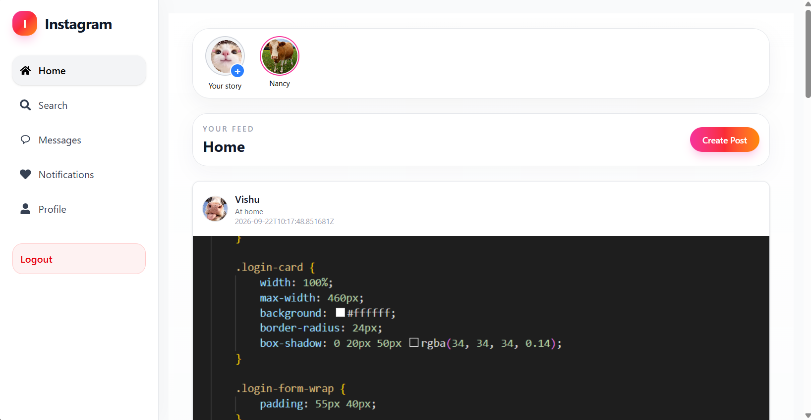
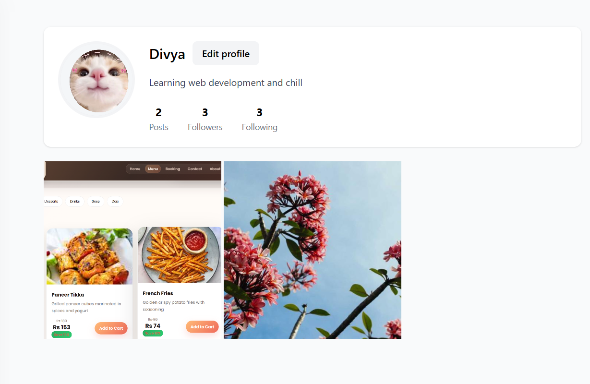
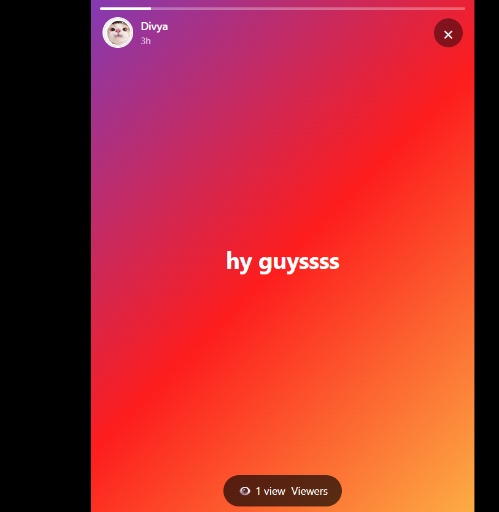
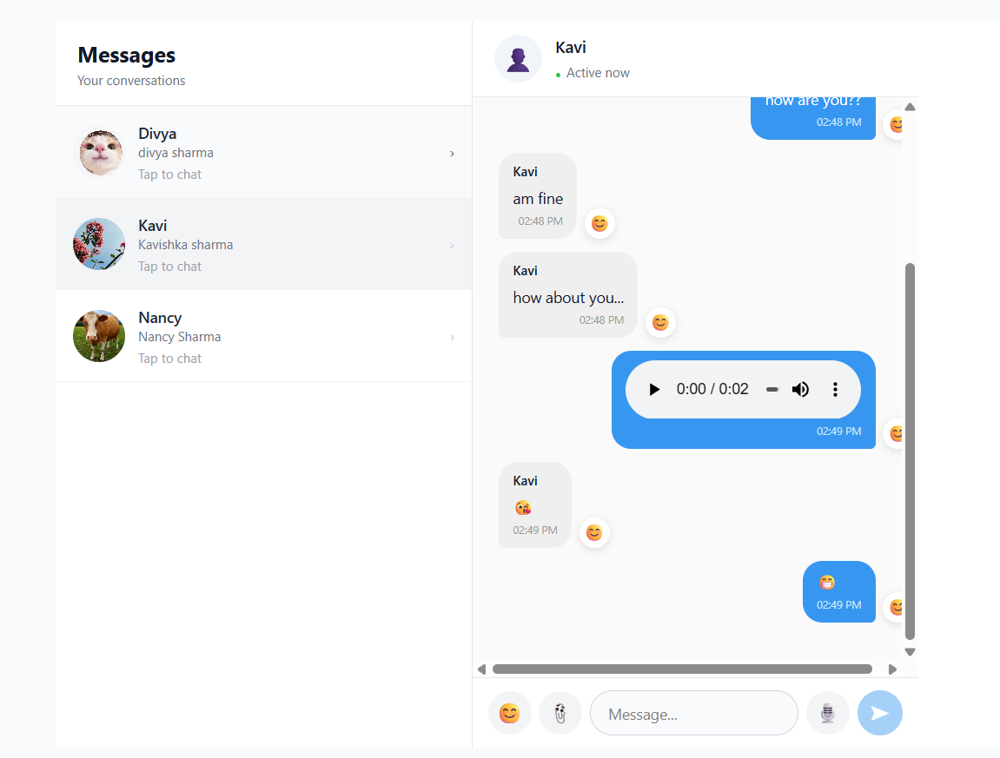
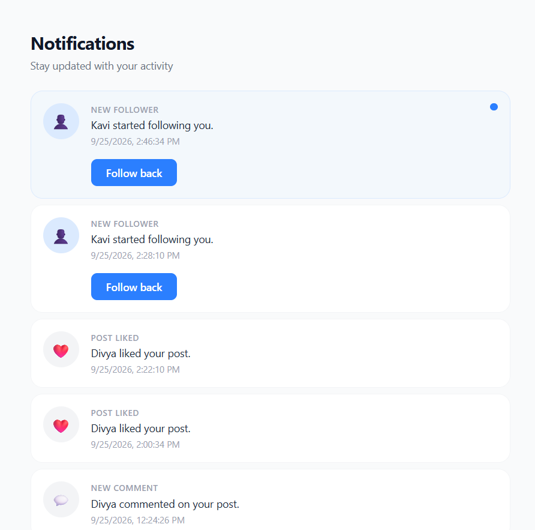
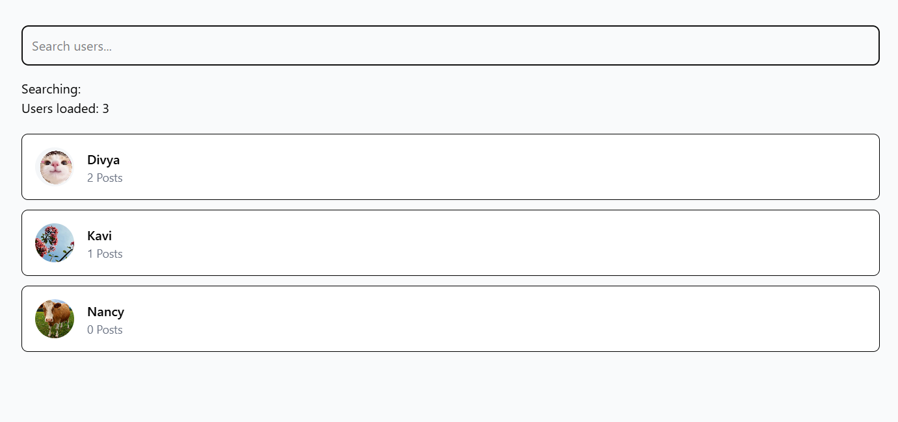

# 📸 Instagram Clone — React + Django

A full-stack Instagram-inspired social media application built using React and Django REST Framework.

The project includes authentication, posts, likes, comments, stories, follow requests, real-time chat, notifications, user search, and profile management.

---

## ✨ Features

### 🔐 Authentication
- User Login & Signup
- Protected Routes
- JWT Authentication
- Password Reset
- Email Verification
- Google Authentication

### 🏠 Social Feed
- Dynamic Instagram-style feed
- Create image posts
- Captions and locations
- Like posts
- Comment on posts
- Delete your own posts

### 👤 User Profiles
- Profile picture
- Bio
- Followers & Following count
- Posts count
- Follow / Unfollow
- Private account support
- Follow requests

### 📖 Stories
- Create image/video stories
- View stories
- Story viewer
- Story reactions
- Story replies
- Story expiration
- Instagram-style "My Story"

### 💬 Real-Time Chat
- User-to-user messaging
- Real-time messages using WebSockets
- Typing indicator
- Message reactions
- Image/video/file attachments
- Message notifications

### 🔔 Notifications
- Like notifications
- Comment notifications
- Follow notifications
- Follow request notifications
- Story notifications
- Message notifications
- Real-time notifications

### 🔍 Search
- Search users
- User profile preview
- Search results

---

## 🛠️ Tech Stack

### Frontend
- React
- Vite
- Tailwind CSS
- JavaScript

### Backend
- Python
- Django
- Django REST Framework
- Django Channels
- WebSockets

### Database
- PostgreSQL / Supabase PostgreSQL

### Other Technologies
- JWT Authentication
- REST APIs
- WebSockets
- Cloudinary for media storage

---

## 📸 Screenshots

### 🏠 Home Feed



### 👤 Profile



### 📖 Stories



### 💬 Real-Time Chat



### 🔔 Notifications



### 🔍 Search



---

## 📚 What I Learned

While building this project, I learned:

- How to build a full-stack application using React and Django
- How React communicates with a Django REST API
- JWT-based authentication
- Protected routes in React
- CRUD operations using REST APIs
- State and props management in React
- Database integration with PostgreSQL
- Django models, serializers and views
- User authentication and authorization
- Follow and follow-request systems
- Private account functionality
- Real-time communication using WebSockets
- Real-time notifications using Django Channels
- Handling image and video uploads
- Frontend and backend project structure
- Git and GitHub workflow

---

## 📁 Project Structure

```text
instagram-clone-react-django/
│
├── backend/
│   └── hlo/
│       ├── accounts/
│       ├── follows/
│       ├── posts/
│       ├── stories/
│       ├── messages/
│       ├── notifications/
│       └── hlo/
│
├── frontend/
│   ├── public/
│   └── src/
│       ├── components/
│       ├── pages/
│       ├── utils/
│       └── App.jsx
│
├── screenshots/
│   ├── home.png
│   ├── profile.png
│   ├── stories.png
│   ├── chat.png
│   ├── notifications.png
│   └── search.png
│
├── .gitignore
└── README.md